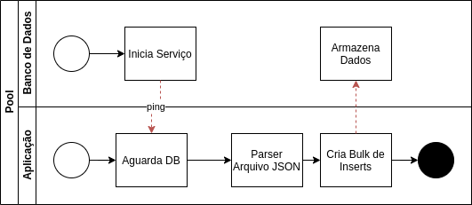
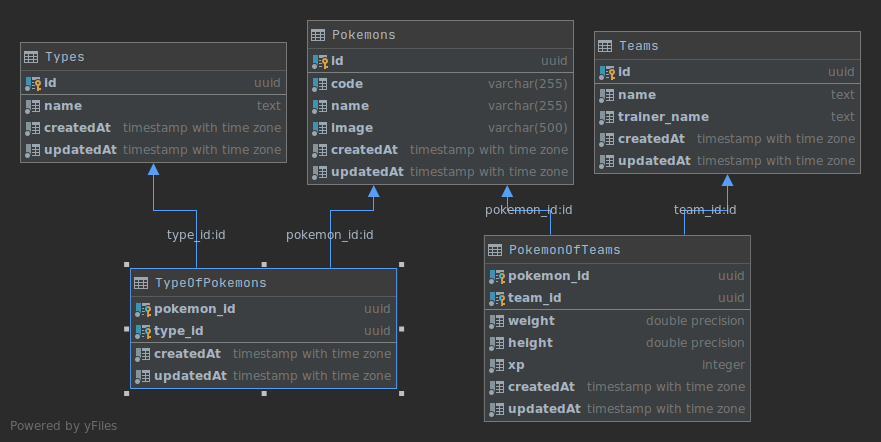

# Méliuz - Backend Pleno

## Instalação/Deploy

### 1 - Dry Run

Essa etapa é importantíssima, é a que povoa o banco de dados com os **schemas** e os **dados do arquivo json**. É possível utilizar a flag `-d` em qualquer etapa do docker-compose, mas para efeitos de visualização, talvez seja melhor não utilizar.

#### 1.1 Deploy do Banco de Dados
Essa arquitetura implementa o princípio de microsserviços, então o banco de dados, o serviço de sincronização e a aplicação do servidor foram separados.

O serviço de banco de dados deve ser iniciado primeiro, uma vez que o serviço da aplicação irá povoá-lo (é possível iniciar a aplicação antes, nesse caso, eu utilizei o script comumente utilizado `wait-for-it.sh` para criar um tempo de espera pelo banco de dados).

Para isso, é necessário utilizar o composer do container informando o environment:

```sh
cd infra/services/postgres
docker-compose --env-file ../../default.env up
```

#### 1.2 Migração dos dados JSON para o banco de dados

Nessa etapa, preparei um composer para o dry-run, é possível iniciar executando o seguinte comando:

```
docker-compose --file docker-compose.dryrun.yaml up
```

Uma vez executado, o banco de dados está ativo e populado, e o serviço de dry-run terminou




### 2 - Deploy

Na etapa de deploy, iniciamos o serviço de sincronização do banco de dados com o Elasticsearch

#### 2.1 Iniciar o serviço PGSync

Nessa etapa, o serviço PGSync inicia consigo o Elasticsearch (para os índices de busca) e o Redis (para armazenar os shards da sincronização) e disponibiliza o serviço do Elasticsearch para a aplicação

```sh
cd infra/services/pgsync
docker-compose --env-file ../../default.env up
```

Uma vez iniciada a sincronização, podemos consumir esses 2 serviços pela nossa API.

#### 2.2 Iniciar API

Para iniciar a API, é possível executar o comando

```
docker-compose --file docker-compose.application.yaml up
```

Logo após isso, a API espera pelo Postgres e pelo Elasticsearch para iniciar (por 60 segundos), e em seguida fica disponível para consumo.


## Organização dos módulos

### Código Fonte

A aplicaçã foi desenvolvida com o princípio de que cada módulo possui vários **Usecases** (Pokemons podem ser PROCURADOS, Equipes podem ser SALVAS, PROCURADAS, DELETADAS e ALTERADAS), e cada um possui um repositório baseado no repositório genérico.

```
src - Todo o código fonte da aplicação
├── api - Módulo de API
│   ├── index.ts
│   ├── ioc - Subconjunto de Inversion of Control (utilizado no elasticsearch para mapear o ambiente de Mock)
│   │   └── es
│   │       ├── es.ioc.context.ts
│   │       └── es.test.mock.ts
│   ├── pokemon
│   │   ├── domain
│   │   │   ├── pokemon.es.querybuilder.ts
│   │   │   ├── pokemon.es.response.dto.ts
│   │   │   └── pokemon.input.dto.ts
│   │   ├── index.ts
│   │   ├── pokemon.controller.ts
│   │   ├── pokemon.es.client.ts
│   │   ├── pokemon.repository.ts
│   │   └── usecases
│   │       ├── pokemon.find.ts
│   │       ├── pokemon.remove.ts
│   │       ├── pokemon.save.ts
│   │       └── pokemon.update.ts
│   ├── pokemonOfTeam
│   │   ├── pokemonOfTeam.repository.ts
│   │   └── usecases
│   │       ├── pokemonOfTeam.find.ts
│   │       ├── pokemonOfTeam.remove.ts
│   │       ├── pokemonOfTeam.save.ts
│   │       └── pokemonOfTeam.update.ts
│   ├── team
│   │   ├── domain
│   │   │   └── team.input.dto.ts
│   │   ├── index.ts
│   │   ├── team.controller.ts
│   │   ├── team.repository.ts
│   │   └── usecases
│   │       ├── team.find.ts
│   │       ├── team.remove.ts
│   │       ├── team.save.ts
│   │       └── team.update.ts
│   ├── type
│   │   ├── type.repository.ts
│   │   └── usecases
│   │       ├── type.find.ts
│   │       ├── type.remove.ts
│   │       ├── type.save.ts
│   │       └── type.update.ts
│   └── typeOfPokemon
│       ├── typeOfPokemon.repository.ts
│       └── usecases
│           ├── typeOfPokemon.find.ts
│           ├── typeOfPokemon.remove.ts
│           ├── typeOfPokemon.save.ts
│           └── typeOfPokemon.update.ts
├── error - Erro Handler genérico
│   ├── catchable.exception.ts
│   └── handler.ts
├── index.ts
├── logger - Logger do sistema
│   └── index.ts
├── models - Entidades transacionais do banco de dados
│   ├── pokemon.of.team.ts
│   ├── pokemon.ts
│   ├── team.ts
│   ├── type.of.pokemon.ts
│   └── type.ts
├── server.ts
└── types - Tipos auxiliares
    ├── express.d.ts
    ├── middlewares.ts
    ├── model.actions.ts
    └── repository.ts
```

### Infraestrutura

A infraestrutura contempla os serviços de banco de dados e de sincronização e armazenamento no módulo de busca contemplado pelo Elasticsearch + Redis

```
infra
├── default.env
└── services
    ├── pgsync
    │   ├── docker-compose.yaml
    │   ├── Dockerfile
    │   ├── entrypoint.sh
    │   ├── schema.json
    │   └── wait-for-it.sh
    └── postgres
        ├── conf.sql
        ├── data [error opening dir]
        ├── docker-compose.yaml
        └── Dockerfile
```

## Ferramentas Utilizadas

### Toolkits
- Elasticsearch  - para a busca por nome/tipo dos pokemons
- PGSync - para sincronizar o banco de dados (PG) com o bundle de buscas (ES)
- PosgtresSQL - para armazenar os dados estaticamente
- Docker/Docker-Composer - para orquestrar e isolar o ambiente de implantação

### Libraries/Linguagens
- Typescript - para agilizar o desenvolvimento
- Express - para expor os serviços
- Joi - para validar a entrada de dados
- Jest + Nock - para adicionar os casos de teste com mock no elasticsearch

## Organização dos Dados


### Migração do arquivo JSON

Para a migração do arquivo JSON recebido, decidi utilizar a própria estrutura do projeto para aproveitar os modelos de entradas de dados, então, o arquivo `scripts/dry-run.ts` basicamente lê o JSON dado (localizado em `assets/pkm.json`), percorre o arquivo linearmente montando uma lista de **Pokemons** e **Tipos** com seus IDs gerados pela lib `uuid` (nesse caso é necessário gerar antes para poder inserir as relações dos pokemons com os tipos no banco de dados), o input de todos esses dados foi realizado em uma transação do banco de dados, para garantir que todas as relações vão íntegras para o armazenamento, ou não vão.

### Diagrama do Banco de Dados

Optei por utilizar relações M:N para mapear os Pokemons com os tipos e com as Equipes.



A tabela **Types** armazena os tipos pertencentes aos pokemons, a tabela **Pokemons** armazena os pokemons propriamente ditos, a tabela **Teams** armazena as equipes. Já as tabelas **TypeOfPokemons** e **PokemonsOfTeams** armazenam os relacionamentos M:N entre as entidades relacionadas.

### Elasticsearch

O elasticsearch serve muito bem nessa situação, onde um conjunto etático de dados deve ser mantido (no caso, em sincronia com o banco de dados original) e ao mesmo tempo expor uma interface eficiente de busca, nesse caso, o PGSYNC foi configurado para espelhar o esquema do banco de dados de maneira parcial, com alguns atributos das tabelas **Pokemons** e **Types**, o arquivo de configurações se encontra em `infra/services/pgsync/schema.json` e possui as informações de comportamentos das tabelas acima descritas.


## Utilização

No arquivo de [documentação](./Documentation.md) existem as rotas disponíveis pelo serviço.

Abaixo um pequeno resumo delas:

- [GET] **/rest/pokemons** - É possível passar 4 parâmetros opcionais, **name**, para pesquisar pokemons pelo nome, com erro de até 2 caracteres providos pelo Elasticsearch; **type**, para pesquisar pokemons pelo tipo, também com até 2 erros de distância na string; size, para limitar o tamanho da janela de resultados; from, para caminhar pela janela de resultados.
- [GET] **/rest/pokemons/:id** - Retorna um pokemon pelo ID
- [GET] **/rest/teams** - Retorna a lista de todas as equipes cadastradas
- [GET] **/rest/teams/:id** - Retorna uma equipe pelo ID
- [POST] **/rest/teams** - Cadastra uma nova equipe, seguindo os requisitos necessários (de 1 a 6 pokemons, nome da equipe e do treinador com no mínimo 5 caracteres)
- [PUT] **/rest/teams/:id** - Altera uma equipe pelo ID, é possível alterar tanto os pokemons quanto os dados da equipe por essa rota
- [DELETE] **/rest/teams/:id** - Deleta uma equipe pelo ID

## Todo

- [x] Listar todos os Pokémon. Esta rota deve permitir filtros por nome e tipo;
- [x] Gravação do time montado pelo usuário.
- [x] Um time tem no máximo 6 Pokémon;
- [x] O nome do time deve ter pelo menos 5 caracteres.
- [x] Sua API deve retornar os dados no formato JSON;
- [x] Sua solução deve ser desenvolvida em Python ou Javascript;
- [x] Ela deve estar documentada da maneira como preferir. A qualidade da documentação também será avaliada;
- [x] Sua solução deve considerar que será enviada para produção, então legibilidade e qualidade geral da solução será avaliada;
-[x] É sua escolha como e onde os dados fornecidos serão armazenados e retornados.
